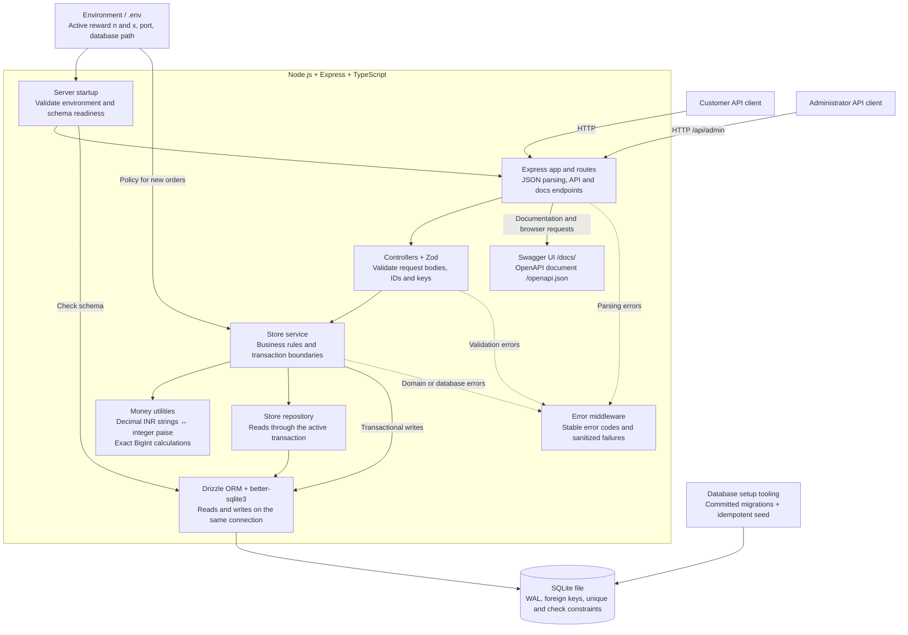
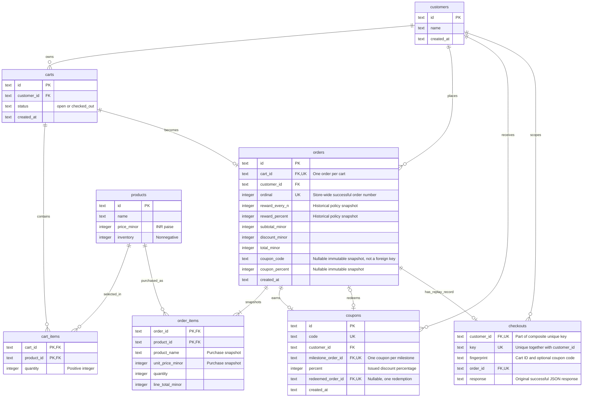

# Architecture and Flows

These diagrams describe the implemented backend. Mermaid diagrams render directly on GitHub and in Markdown viewers with Mermaid support. Endpoint details are in [API.md](API.md); trade-offs are in [DECISIONS.md](DECISIONS.md).

## Architecture

Checkout, cart edits, and admin generation use synchronous **`BEGIN IMMEDIATE`** transactions. SQLite serializes writers across processes sharing the same local file; a five-second lock timeout becomes `503 DATABASE_BUSY`. Multi-query resource views and reporting use consistent read transactions. Reporting does not mutate state.

The environment is the sole active policy source. Orders retain historical n/x snapshots; coupons retain their issued percentage. Restart after changing `.env`, and give all application instances the same configuration. Authentication and authorization are outside this assignment; customer IDs are trusted inputs and admin routes are administrative by convention.

## Entity Relationship Diagram

- `PK` identifies primary keys; both marked fields together form the primary key in each item table. `FK` is a foreign key; `UK` is a unique key.
- In `checkouts`, `(customer_id, key)` is one **composite unique index**, not two independently unique columns. The table has no declared primary key.
- The two order-to-coupon relationships have different meanings: `milestone_order_id` records the earning order; nullable `redeemed_order_id` records a later redeeming order. A single order can redeem an older coupon and earn a new one.
- An order has at least one item through checkout validation. Foreign keys alone do not enforce that minimum. Successful checkout also creates exactly one replay record; the diagram allows its absence at the database relationship level.
- All stored monetary amounts are integer paise. API responses format them as decimal INR strings. No active reward-policy table remains.

## Customer and Administrator Flows

```mermaid
flowchart TB
    subgraph CustomerFlow["Customer flow"]
        Start([Start]) --> Customer["Create customer<br/>POST /api/customers"]
        Customer --> Browse["View products and stock<br/>GET /api/products"]
        Browse --> Cart["Create owned cart<br/>POST /api/carts"]
        Cart --> Edit["Add or replace quantities with PUT<br/>Remove items with DELETE"]
        Edit --> View["View cart<br/>Live prices and availability; no reservation"]
        View --> Ready{Ready to purchase?}
        Ready -->|No| Edit
        Ready -->|Yes| Coupons["Optionally view owned coupons<br/>GET /api/customers/:customerId/coupons"]
        Coupons --> Checkout["POST /api/carts/:cartId/checkout<br/>Idempotency-Key + optional couponCode"]
        Checkout --> Lock{Writer lock acquired?}
        Lock -->|Timeout| Busy["503 DATABASE_BUSY<br/>Retry with the same key"]
        Busy --> Checkout
        Lock -->|Yes| Saved{Successful key already stored?}
        Saved -->|Yes| Match{Same cart and coupon?}
        Match -->|No| Conflict["409 IDEMPOTENCY_CONFLICT"]
        Match -->|Yes| Replay["Return original 201 response<br/>Idempotency-Replayed: true"]
        Saved -->|No| Validate["Validate open, nonempty cart<br/>Current stock, prices and coupon ownership"]
        Validate --> Valid{Valid checkout?}
        Valid -->|No| Failed["Return domain error<br/>Roll back; key remains reusable"]
        Failed --> Correct["Fix the reported problem<br/>Cart, quantity, coupon or key"]
        Correct --> View
        Valid -->|Yes| Purchase["Within one transaction:<br/>Decrement stock; create order and item snapshots<br/>Redeem coupon; close cart<br/>Assign next ordinal; snapshot active n/x"]
        Purchase --> Milestone{Ordinal divisible by order's n?}
        Milestone -->|Yes| Reward["Generate owned coupon<br/>Use order's x; available for a later purchase"]
        Milestone -->|No| Save["Store successful response and key"]
        Reward --> Save
        Save --> Commit["Commit, then return 201<br/>Order + optional earned coupon"]
        Commit --> Received{Response received?}
        Received -->|No or timeout| Checkout
        Received -->|Yes| Inspect["Retrieve immutable order<br/>View current coupon status"]
        Replay --> Inspect
        Inspect --> Next{Another purchase?}
        Next -->|Yes| Browse
        Next -->|No| Done([Done])
    end

    subgraph AdminFlow["Administrator flow"]
        AdminStart([Admin operation]) --> Action{Choose operation}
        Action -->|Generate missing reward| Generate["POST /api/admin/coupons<br/>Acquire immediate transaction"]
        Generate --> Eligible{Historical milestone missing coupon?}
        Eligible -->|No| None["409 NO_ELIGIBLE_MILESTONE<br/>Normal after automatic issuance"]
        Eligible -->|Yes| Issue["Choose oldest eligible order<br/>Use its owner and historical n/x<br/>Create coupon, commit, return 201"]
        Action -->|View report| Report["GET /api/admin/report<br/>One read transaction"]
        Report --> Summary["200: purchased quantities, gross revenue<br/>Discounts, net revenue, order count<br/>Coupon counts and records"]
    end
```

Any exception in the new-checkout transaction rolls back **all** mutations, including inventory, order creation, coupon redemption, cart status, new rewards, and replay storage. The diagram's failure path also covers those exceptions: known domain errors receive their documented status; unexpected failures receive a sanitized `500`.

An already completed cart requires the **original** key and coupon input for replay. A new key receives `409 CART_ALREADY_CHECKED_OUT`; a different cart or coupon under an existing customer-scoped key receives `409 IDEMPOTENCY_CONFLICT`. A new coupon cannot discount the order that earned it.
